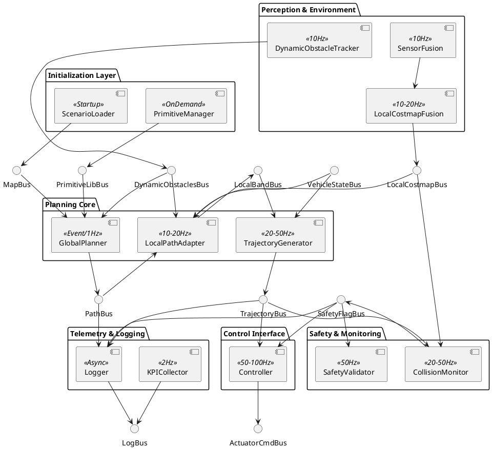
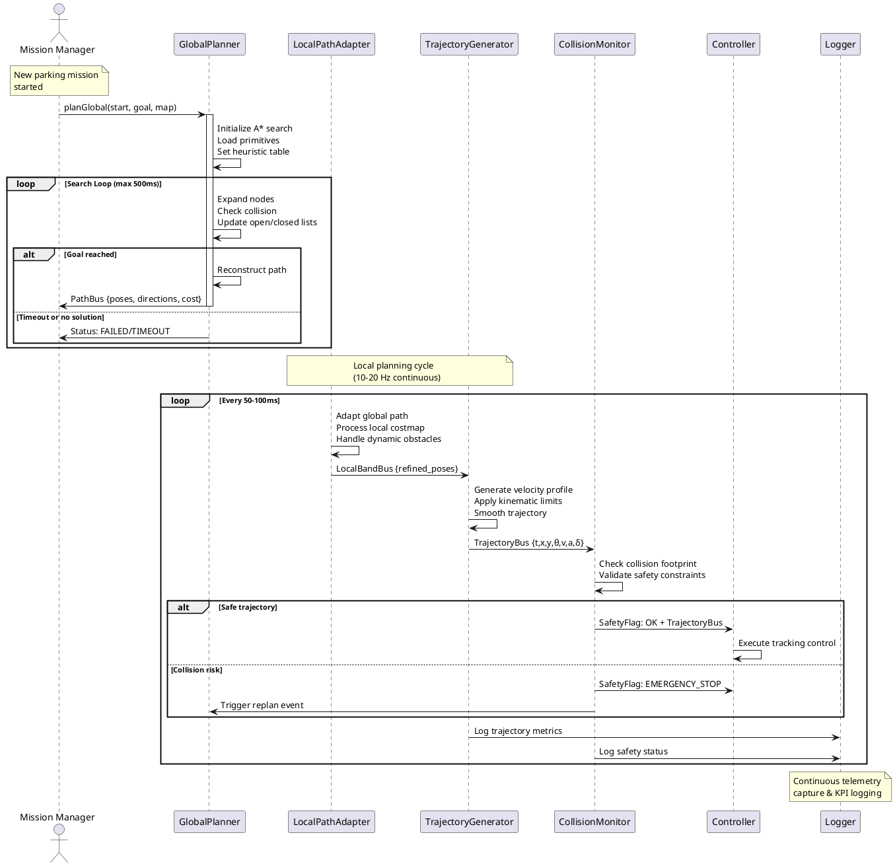

# Motion Planning Architecture (Autonomous Valet Parking)

Author: Architect Mode  
Date: 2025-09-21  
Scope: 3-DOF (x, y, heading) low-speed vehicle path & trajectory planning for autonomous valet parking. Integrates with MATLAB/Simulink execution environment while allowing Python (CasADi) tool-assisted primitive generation.

---
## 1. Architectural Overview
Layers:
1. Scenario & Map Layer
2. Motion Primitive Generation Service
3. Global Planner (Hybrid A* core; lattice fallback)
4. Local Planner / Path Adapter (TEB or Elastic Band + collision monitor)
5. Velocity & Trajectory Layer (Segment S-Curve → MPC upgrade path)
6. Control Interface (Tracking controller outside current scope)
7. Telemetry & Verification Layer (logging, KPIs, MBSE traceability)

Data Artifacts (Canonical):
- `VehicleParams`: wheelbase, width, length, min_turn_radius, max_steer_rate
- `ScenarioConfig`: map polygons, parking slots, start pose, goal pose, regulatory zones
- `PrimitiveLib`: dictionary keyed by (theta_bin, direction, primitive_id) -> primitive struct
- `GlobalPath`: ordered list of path nodes {x,y,theta,direction,cost}
- `LocalBand`: short horizon refined path (time-less or time-stamped)
- `Trajectory`: time-parameterized states {t,x,y,theta,v,a,steer}
- `DynamicObstacles`: list of predicted trajectories / occupancy footprints
- `PlannerStats`: expansions, open_size_max, latency_ms, reverse_count

---
## 2. Motion Primitive Generation (CasADi vs ACADO)
Goal: Produce kinematically feasible motion segments respecting steering & curvature bounds for use in lattice/Hybrid A* expansion.

### 2.1 Requirements
- Support forward & reverse segments
- Variable primitive lengths (short, medium, alignment maneuvers)
- Curvature continuity (C1 for steering angle; optional C2 upgrade later)
- Parameterizable for different vehicle geometries without regenerating all code manually
- Exportable to MATLAB for integration (MAT-files or JSON + binary arrays)

### 2.2 CasADi-Based Generator (Python)
Workflow:
1. Define kinematic bicycle model: 
   x_dot = v * cos(theta); y_dot = v * sin(theta); theta_dot = v/L * tan(delta); delta_dot constrained.
2. Formulate optimal control problem for a primitive from initial (x=0,y=0,theta=0, delta=0) to target (x_f, y_f, theta_f) with bounds.
3. Objective: Minimize weighted sum (∫(delta_rate^2 + w1 * curvature_error + w2 * length)).
4. Discretize horizon (N=20–40) → multiple candidate lengths & terminal headings.
5. Solve with IPOPT via CasADi in batch for grid of target headings / lateral offsets.
6. Normalize trajectories to local frame; store arrays x[], y[], theta[], steer[], length, direction.
7. Save as MAT (scipy.io.savemat) or HDF5; ingest in MATLAB with loader script.

Pros vs ACADO:
- Active project & Python ecosystem synergy.
- Easier parameter sweeps (vectorization / multiprocessing).
- Symbolic differentiation built-in; quick model variation.
- Flexible objective tuning & constraint experimentation.

Cons:
- Need Python toolchain in build pipeline.
- Potential numerical differences vs ACADO (validation required).
- Larger initial engineering to wrap outputs & verify curvature bounds.

Mitigation: Freeze primitive set with version stamp & hash; regression compare path quality & solver feasibility rate.

### 2.3 ACADO (Current Prototype)
Pros: Integrated with MATLAB; real-time iteration patterns.  
Cons: Less active; harder Python integration; regeneration tied to MATLAB environment.

### 2.4 Decision
Adopt CasADi Python for next-gen primitive generation pipeline; retain existing ACADO primitives for baseline regression until new library validated. Provide dual-mode loader.

### 2.5 Interface Contract (Primitive Record)
```
Primitive = struct(
  id: string,
  direction: int (1=forward, -1=reverse),
  duration: double,
  length: double,
  states: [N x 3] (x,y,theta),
  controls: [N x 1] (steer angle),
  curvature: [N x 1],
  max_curvature: double,
  terminal: struct(x,y,theta,delta),
  meta: struct(version, vehicle_hash, generator_hash)
)
```

---
## 3. Global Planner (Hybrid A*)
### 3.1 Responsibilities
- Search over continuous (x,y) with discretized θ bins (e.g., 5–7.5 deg)
- Use motion primitives as expansion actions (rotated / mirrored as needed)
- Heuristic: Reeds-Shepp distance (precomputed table indexed by Δx, Δy, Δθ with interpolation)
- Cost function components: distance, direction penalty, clearance cost (sample-based), reverse transition count penalty

### 3.2 Key Algorithms
- Priority queue (binary heap) keyed by f = g + h
- Closed hash: key = round(x/res_xy), round(y/res_xy), theta_bin
- Analytic Goal Expansion: attempt direct Reeds-Shepp connection; if collision-free → early finish
- Multi-Resolution: coarse grid far from goal, refine near docking zone (adaptive resolution switching trigger based on distance remaining)

### 3.3 Pseudocode (Simplified)
```
open.push(start)
while open not empty:
  n = open.pop_min()
  if goal_reached(n): return reconstruct(n)
  for prim in expand_primitives(n):
     m = apply(prim, n)
     if collision(m): continue
     key = hash(m)
     if better_path_found(key, m.g):
        m.h = heuristic(m, goal)
        open.push(m)
```

### 3.4 MATLAB / Simulink Integration
- MATLAB function: `[path, stats] = hybridAStar(env, startPose, goalPose, primitiveLib, options)`
- Simulink wrapper block:  
  Inputs: MapStruct, StartPose (bus), GoalPose (bus), DynamicObstacles, Options  
  Outputs: PathBus, Status, StatsBus
- Code Generation: Preallocate arrays (maxNodes), fixed-size primitive slice, disable dynamic figure calls.

---
## 4. Local Planner / Path Adapter
### 4.1 Function
Refines global path to handle short-term dynamic obstacles and produce collision-free corridor.

### 4.2 Algorithm Options
- Timed Elastic Band (TEB) (baseline after Phase 1)
- Interim simpler: Elastic Band without timing + velocity layer handles temporal dimension.

### 4.3 Inputs / Outputs
Inputs: GlobalPath, LocalCostmap, DynamicObstacles, VehicleState.  
Outputs: LocalBand (poses), Optional time stamps if TEB enabled.

### 4.4 Collision Strategy
- Discrete footprint sampling every ds (≤0.2 m) and heading interpolation.
- Inflate obstacles by vehicle footprint + safety margin.
- Maintain minimal clearance metric.

---
## 5. Velocity & Trajectory Layer
### 5.1 Phase 1 (Deterministic Profiles)
- Segment classification (forward / reverse blocks)
- S-curve velocity planning respecting: max_v_fwd, max_v_rev, a_max, jerk_max
- Add dwell at direction changes for gearbox & perception stabilization

### 5.2 Phase 2 (TEB Time Optimization or MPC)
- TEB couples spatial band and temporal spacing; optimize arrival times under dynamic obstacle constraints.
- MPC alternative: horizon 2–3 s, linearized kinematic model, quadratic cost (tracking + smoothness + steering effort)

### 5.3 Interface
`trajectory = generateTrajectory(localBand, vehicleParams, limits, opts)`

---
## 6. Telemetry & KPIs
Metrics Captured:
- Global planning latency ms
- Nodes expanded
- Heuristic error samples (h / true_dist)
- Reverse maneuver count & total reverse distance
- Min clearance (static/dynamic)
- Local replans per minute
Storage: JSON lines or MAT struct with timestamp; versioned with software build hash.

---
## 7. MBSE Traceability Skeleton
| Requirement ID | Description | Allocated To | Verification Method |
|----------------|-------------|--------------|---------------------|
| REQ-GLB-001 | Path plan within 500 ms (≤ 300 obstacles) | Hybrid A* | SIL timing test |
| REQ-GLB-002 | Min clearance ≥0.25 m | Global + Local Planner | Simulation scenario suite |
| REQ-LOC-003 | Replan latency ≤150 ms after obstacle detection | Local Planner | HIL test bench |
| REQ-TRJ-004 | Reverse speed ≤1.5 m/s | Velocity Layer | Unit + runtime monitor |
| REQ-SFT-005 | Emergency stop latency ≤50 ms | Collision Monitor | Fault injection test |

---
## 8. Simulink Block View & Diagrams

### 8.1 Block Architecture (Component View)


### 8.2 Planning Execution Flow (Sequence View)


### 8.3 Bus Signal Definitions
Bus Structures (MATLAB Struct format):

**MapBus**
```matlab
MapBus = struct(...
  'staticObstacles', struct('polygons', {}, 'ids', []), ...
  'parkingSlots', struct('corners', {}, 'types', [], 'occupied', []), ...
  'boundaries', struct('outer', [], 'lanes', {}), ...
  'timestamp', 0, ...
  'frame_id', 'map' ...
);
```

**PathBus** 
```matlab
PathBus = struct(...
  'length', 0, ...
  'poses', struct('x', [], 'y', [], 'theta', []), ...
  'directions', [], ... % 1=forward, -1=reverse
  'cost_total', 0, ...
  'reverse_count', 0, ...
  'status', 'VALID', ... % VALID|INVALID|COMPUTING
  'timestamp', 0 ...
);
```

**TrajectoryBus**
```matlab
TrajectoryBus = struct(...
  'time', [], ...        % [N x 1] time stamps
  'poses', struct('x', [], 'y', [], 'theta', []), ... % [N x 3]
  'velocities', [], ...   % [N x 1] longitudinal velocity
  'accelerations', [], ... % [N x 1] 
  'steering', [], ...     % [N x 1] steering angle [rad]
  'length', 0, ...       % total path length
  'duration', 0, ...     % total time duration
  'timestamp', 0 ...
);
```

**DynamicObstaclesBus**
```matlab
DynamicObstaclesBus = struct(...
  'count', 0, ...
  'obstacles', struct(...
    'id', [], ...
    'poses', struct('x', [], 'y', [], 'theta', []), ...
    'velocities', struct('vx', [], 'vy', []), ...
    'predictions', struct('future_poses', {}, 'covariance', {}), ...
    'classification', [] ... % PEDESTRIAN|VEHICLE|UNKNOWN
  ), ...
  'timestamp', 0 ...
);
```

### 8.4 Scheduling & Timing Constraints
| Block | Rate | Trigger | Max Latency | Priority |
|-------|------|---------|-------------|----------|
| ScenarioLoader | Init | Startup | N/A | Low |
| PrimitiveManager | On-demand | Vehicle config change | <100ms | Medium |
| GlobalPlanner | Event/1Hz | Start/Replan/Timer | <500ms | High |
| LocalCostmapFusion | 10-20Hz | Sensor data | <50ms | High |
| LocalPathAdapter | 10-20Hz | New costmap | <100ms | High |
| TrajectoryGenerator | 20-50Hz | New local band/timer | <50ms | Critical |
| CollisionMonitor | 20-50Hz | New trajectory | <20ms | Critical |
| Controller | 50-100Hz | New trajectory | <10ms | Critical |
| Logger | Async | Data available | <200ms | Low |

### 8.5 Block Implementation Notes for Developer

**Priority Implementation Order:**
1. **Bus Definitions** - Create all bus structures and type definitions first
2. **GlobalPlanner** - Core Hybrid A* with basic heuristic (Euclidean initially)
3. **TrajectoryGenerator** - Segment-based S-curve velocity profiles
4. **CollisionMonitor** - Basic footprint collision checking
5. **LocalPathAdapter** - Simple elastic band without timing
6. **Logger** - Basic MAT-file output structure
7. **Advanced features** - TEB, MPC, Reeds-Shepp heuristic, multi-resolution

**Code Generation Considerations:**
- Use `coder.varsize` for variable-length arrays with upper bounds
- Preallocate arrays with `maxNodes`, `maxObstacles`, `maxTrajectoryPoints`
- Avoid dynamic memory allocation in critical path blocks
- Use `coder.ceval` for calling external C libraries if needed (e.g., collision detection)
- Disable figure/plotting commands with `coder.target('MATLAB')` checks

**Testing Strategy:**
- Unit test each block with synthetic bus data
- Create test harnesses with signal builders for bus inputs
- Use Simulink Test for automated scenario regression
- Profile timing with Simulink Profiler for real-time constraints validation

---
## 9. Configuration Management (Updated with Finalized Requirements)
Config file (YAML/JSON): planner.yaml
```yaml
# FINALIZED CONFIGURATION - Based on Stakeholder Requirements (Sept 23, 2025)
vehicle:
  wheelbase: 2.55          # [m] Confirmed stakeholder spec
  width: 1.75              # [m] Confirmed stakeholder spec  
  length: 4.07             # [m] Confirmed stakeholder spec
  min_turn_radius: 5.3     # [m] Confirmed stakeholder spec
  
limits:
  v_forward_max: 2.5       # [m/s] Stakeholder range: 2-3 m/s
  v_reverse_max: 1.25      # [m/s] Stakeholder range: 1-1.5 m/s
  a_max: 2.5               # [m/s²] Stakeholder range: 2-3 m/s²
  jerk_max: 1.5            # [m/s³] Stakeholder range: 1-2 m/s³
  steer_angle_max: 44      # [deg] Confirmed stakeholder spec
  steer_rate_max: 35       # [deg/s] Stakeholder range: 30-40 deg/s
  direction_change_dwell: 0.75  # [s] Stakeholder range: 0.5-1.0 s

environment:
  # Phase 1 Targets (Confirmed by stakeholder)
  max_static_obstacles: 50    # Phase 1: 25-50
  max_dynamic_obstacles: 3    # Phase 1: 0-2 pedestrians + 0-1 vehicle
  parking_space_width: 2.4    # [m] Stakeholder range: 2.3-2.5 m
  parking_space_length: 4.9   # [m] Stakeholder range: 4.8-5.0 m
  
safety:
  clearance_static_min: 0.75     # [m] Stakeholder range: 0.5-1.0 m
  clearance_dynamic_min: 1.5     # [m] Stakeholder range: 1.0-2.0 m
  sensor_uncertainty_factor: 1.35 # [-] Stakeholder range: 1.2-1.5x
  
performance:
  planning_timeout_initial: 1250  # [ms] Stakeholder range: 500-2000ms
  planning_timeout_replan: 200    # [ms] Stakeholder range: 100-300ms
  emergency_stop_max: 100         # [ms] Stakeholder range: 50-150ms
  
planner:
  theta_bins_deg: 7.5
  res_xy: 0.25
  # Path Quality Priorities (Confirmed by stakeholder):
  # 1. Minimum path length, 2. Minimum time, 3. Comfort, 4. Efficiency
  reverse_penalty: 1.2
  direction_change_penalty: 5.0
  clearance_weight: 2.0
  comfort_weight: 1.5        # Priority 3: passenger comfort
  efficiency_weight: 1.0     # Priority 4: computational efficiency
  heuristic: reeds_shepp
  
local:
  costmap_size: [20,20]
  resolution: 0.1
  teb_enabled: false         # Phase 1: Simple elastic band
  
integration:
  # Confirmed: MATLAB/Simulink Native (Option 1)
  interface_type: "simulink_native"
  input_format: "simulink_bus"
  output_format: "trajectory_bus_waypoints"
  ros_bridge_enabled: false  # Future extension
  
telemetry:
  log_level: INFO
  kpi_sampling_rate_hz: 2
  
# Edge Case Handling (Confirmed strategies)
edge_cases:
  no_path_strategy: "report_failure_suggest_alternatives"
  sensor_degraded_strategy: "reduce_speed_50pct_increase_margins"
  path_blocked_strategy: "wait_5s_replan_request_assistance"
  computational_overload_strategy: "degrade_resolution_fallback_lattice"
```

---
## 10. Validation & Regression Strategy
- Primitive Validation: Check curvature, continuity, endpoint error < tolerance.
- Path Planner Benchmarks: Synthetic grid, random obstacles, parking lot corpus.
- SIL Suite: 50 canonical valet scenarios (angled slots, tight reverse, encroaching pedestrian).
- HIL: Real-time constraint timing with rest-bus simulation (CAN / actuation emulator).
- Change Impact: Hash primitive library & heuristic table; mismatch triggers regression run.

---
## 11. Risk & Mitigation Snapshot
| Risk | Impact | Mitigation |
|------|--------|-----------|
| Heuristic inadmissibility | Suboptimal paths | Validate h ≤ true RS distance on sample grid |
| Python dependency failures | Build break | Cache generated primitives in repo w/ version tag |
| Dynamic obstacle modeling oversimplified | Unsafe path selection | Incremental upgrade to intent models |
| Reverse oscillations | Passenger discomfort | Add direction change penalty + smoothing |
| Memory growth large maps | Latency spikes | Multi-resolution + node cap + fallback coarse plan |

---
## 12. Next Implementation Steps
1. Implement Python CasADi primitive generator prototype.
2. Generate baseline primitive set & store `primitive_lib_v1.mat`.
3. Develop MATLAB `hybridAStar.m` with heap + RS heuristic stub.
4. Create Simulink bus definitions and wrapper blocks skeleton.
5. Add logging utility (MATLAB class) capturing KPIs.
6. Build initial regression scenario script.

---
## 13. Appendices
### 13.1 Reeds-Shepp Heuristic Note
Precompute RS distances over grid (Δx, Δy ∈ [-R,R], Δθ ∈ bins) normalized by min_turn_radius; bilinear interpolate at query; multiply by base cost weight.

### 13.2 MATLAB Function Signatures (Draft)
```
function primitives = loadPrimitiveLib(file)
function d = reedsSheppHeuristic(pose, goal, cache, vehicleParams)
function [path, stats] = hybridAStar(env, startPose, goalPose, primitiveLib, options)
function band = adaptLocalPath(globalPath, localCostmap, dynObs, vehicleState, options)
function traj = generateTrajectory(band, vehicleParams, limits, options)
```

---
Prepared by: Architect Mode
